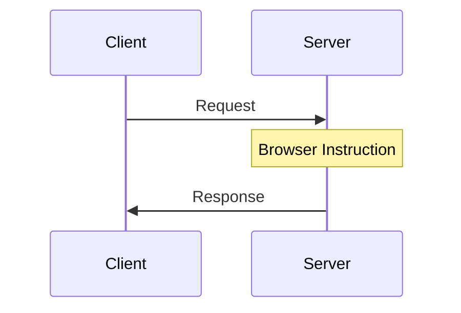
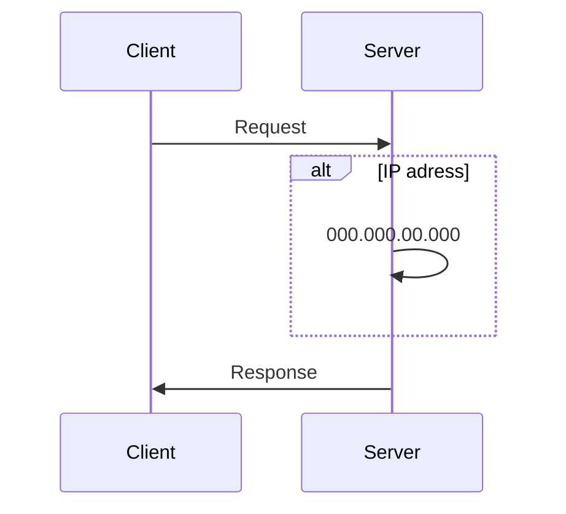
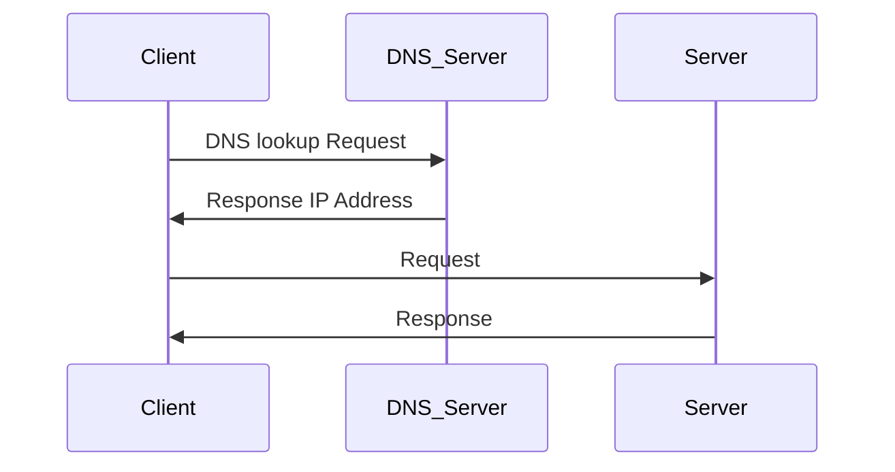

# HTTP(s)
## Hypertext Transfer Protocol (Secure)

# HTML
## Hypertext Markup Language
content and structer

# CSS
## Cascading Style Sheet
html makes prettier

# JavaScript
to add interactivity to a website

# URL
## Uniform Resource Locator
https://hogehoge.example.com/index  
protocol://domain/path

# Domain Name System

## Internet Protocol
Every website(device) has IP address but it's not memorable.  
so we use Domain Name System alternatively.  
stores domain <--> IP 

check it on `Google Domain`

# how to create a website
we need `web browser` and `html`  
any website is ok